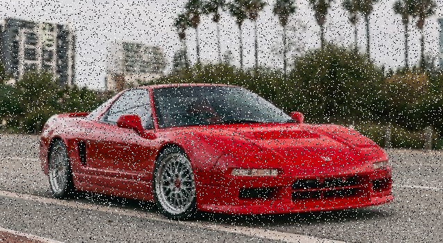
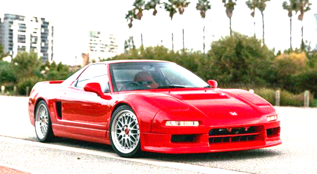
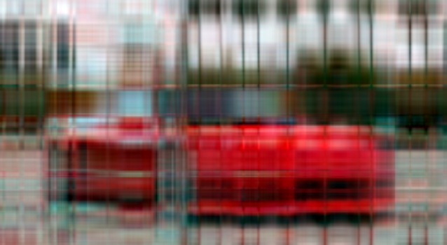
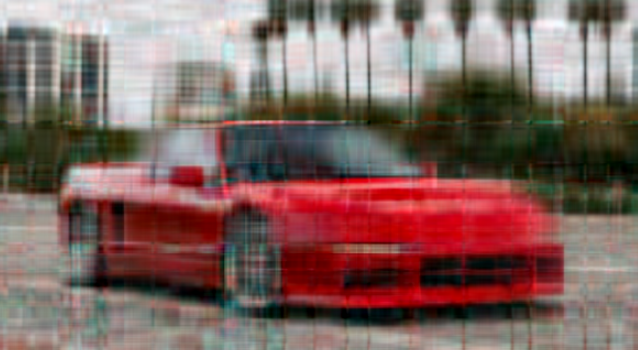

# image_denoising
## Types of noises used 

#### Gaussian Noise: add to each pixel a value  from a gaussian density function

#### Salt and Pepper Noise: randomly set some pixels to 0 (salt) or 255 (pepper)

## Median filter
Choose an odd window/kernel size (3 x 3, 5 x 5) around each pixel from the image, sort the list, and the new value for that pixel is the median from the sorted list. Effective for images corrupted by defective pixels.

    before 

    after

## Gaussian blur
Choose an odd window/kernel size (3 x 3, 5 x 5), that contains elemenents from a gaussian pdf, then each component will be the sum of the multiplications between the original pixel and the elements from the kernel. Usually applied as a preprocessing step, in order to reduce detail/noise.

 original/before

 after 

## SVD
In the singular value decomposition (SVD), a matrix A can be decomposed using 3 matrices, `A = U * Σ * Vᵀ`, where U and V are orthogonal, meaning `U * Uᵀ = I`, and Σ is a diagonal matrix, whose non-zero values are the eigenvalues of A.

Power iteration is an iterative algorithm for finding the biggest eigenvalue from a matrix, starting from a random, but normalized vector `v`. If the rank of the matrix is deflated at each iteration, then it can be used to approximate all the eigenvalues.

Aditionally, the left and right singular vectors can also be approximated in the process, making matrix reconstruction possible.

`A * v1 = U * Σ * Vᵀ * v1`. v1 is the first column of V, and since V is orthogonal,  `Vᵀ * v1 = e1`, where e1 is the first column from the identity matrix. Σ * e1 will be just the first singular value, σ1​.

The equation is therefore reduced to `A * v1 = U * σ1​ * e1` (with σ1​ being just a scaler), so `A * v1 = u1 * σ1​`. Take the norm of both sides and the result is `||A * v1|| = σ1` (the norm of a singular vector is always normalized). Reintroduce in the equation above and `u1 = (A * v1) / ||A * v1||`.

Similar steps are taken to deduce the update formula for v, with the subtle change that U needs to be on the right side. We can accomplish this by taking the transposde of A `Aᵀ = V * Σᵀ * Uᵀ`. It then follows that `v1 = (Aᵀ * u1) / σ1`.

#### We can approximate the image by using only the k biggest eigenvalues and singular vectors from the decomposition.

 before svd

 after svd (k = 50)

 gaussian blur after svd

If ran on the original input, it's esentially compression.

### image compression

 k=5 

 k=25

 k=50

 k=75

## Run the project

#### prerequisites: Eigen installed (C++ library similar to numpy) 

From the root of the project: 
``` 
cmake --build build
./build/image_denoising full/path/to/image mode kForSVD

# mode = blur / filter / SVD
# kForSVD = optional parameter, an integer used when reconstructing the image using SVD
```