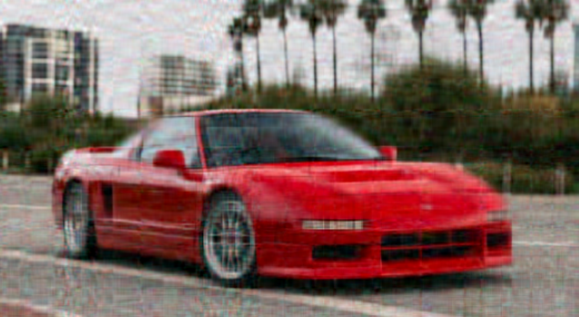

# image_denoising

### image compression

Power iteration is an iterative algorithm for finding the biggest eigenvalue from a matrix. If the rank of the matrix is deflated at each iteration, then it can be used to approximate all the eigenvalues.

Aditionally, the left and right singular vectors can be approximated too in the process, making matrix reconstruction possible.

#### If only we use the k biggest eigenvalues and singular values,compression of the input is possible.

original

k=25

k=50

k=75

k=100

